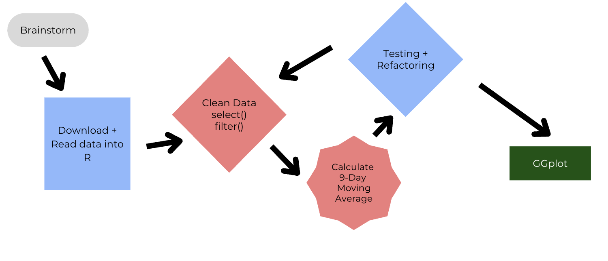

# EDS-214: Workflows and Reproducibility Case Study- Hurricane Effects on the Chemistry of Stream Water in the Loquillo Mountains Watershed, Puerto Rico

This repository includes the code used to replicate the analysis of nutrients present in four water sheds in the Loquillo Mountain Watershed. The final goal is to recreate a visual of the four watersheds nutrient levels depicting nutrient levels before and after 1989 Hurricane Hugo.

## Workflow

## Data

Raw data is stored in the data folder as individual files for each of the four watersheds being analyzed. The processed data was read in and processed for the necessary data to produce the final figure and can be found in the output folder.

Raw data can also be downloaded through the [EDI Data Portal](https://portal.edirepository.org/nis/mapbrowse?packageid=knb-lter-luq.20.4923064).

## Analysis Script
A function was created to perform the 9-week moving average. The function runs by identifying the date for which the 9 week average will be determined. All of the other dates in the dataframe are run to identify if they are within the 9 week centre window. The values for the nutrient contents of the streams corresponding to the dates within the data are averaged. 

This function was then called by the moving average calculation script. The moving average calculation groups by site, calculates the 9 week moving average, and selects only necessary columns for each graph. The R scripts containing the function and calculations can be found in the R folder. 

## Outputs
All of the resulting dataframes from the analysis have been provided in the output folder. This folder has a compiled data file as well as files for moving averages of all of the tested nutrients. 

The final figure is stored in the figs folder. 

## Supporting Code
Code cleaning data, initializing an environment, and plotting the data can also be found in the R folder. 

## References

Schaefer, Douglas. A., William H. McDowell, Fredrick N. Scatena, and Clyde E. Asbury. 2000. “Effects of Hurricane Disturbance on Stream Water Concentrations and Fluxes in Eight Tropical Forest Watersheds of the Luquillo Experimental Forest, Puerto Rico.” Journal of Tropical Ecology 16 (2): 189–207. <https://doi.org/10.1017/s0266467400001358>.
